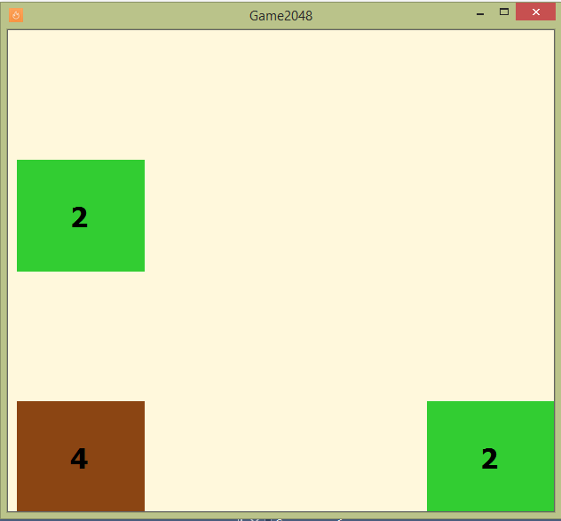
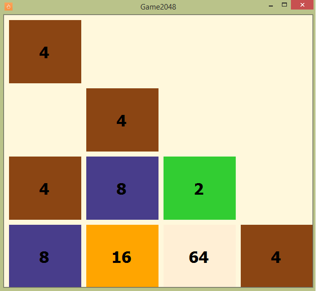

# Game 2048
> Ñlassic implementation of the Game 2048

## Table of contents
* [General info](#general-info)
* [Screenshots](#screenshots)
* [Technologies](#technologies)
* [Contact](#contact)

## General info
Application written by me in 2015 as part of the study of the course of algorithms.
Game 2048 is a single-player sliding block puzzle game.

## Screenshots

## Technologies
* C#
* Windows Forms

## Contact
Created by Anton Kozhanov [deal.for at gmail.com]
